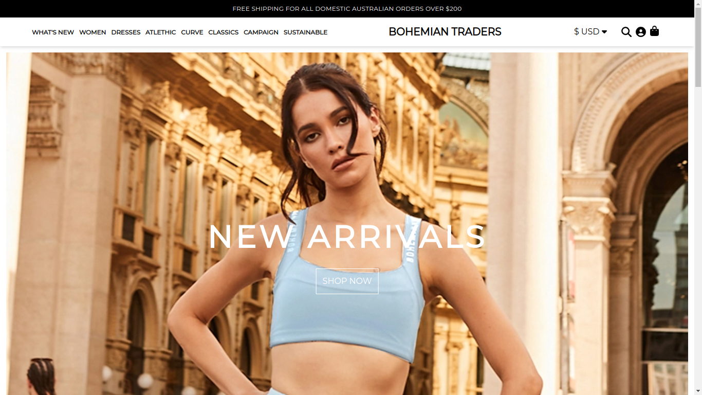

# Bohemian Traders Clone

An attempt to clone the (bohemiantraders.com)[bohemiantraders.com]

[Home Page](./src/assets/project/home-page.png)

## Functionalities Implemented

- Adding Item to Cart.
- Removing Item From Cart.
- Displaying Total Number Of Item Present In Cart.
- Displaying Total Cost Of All Items Present In Cart.
- Increasing And Decreasing Quantity Of Item In Cart.
- Authentication with firebase e.g signInWithEmailAndPassword etc
- Forgot Password
- Creating an Account
- Quick View Feature
- Currency Change Feature
- Search Feature
- Filter Products By Categories
- View Product Extensively
- Error Message Display
- Multiple DropDown Navigation on Mobile

## Interface Overview

> home page Display

> categories 

> shopping categories

> product display Page

> sign In page

> create account page

> Error page

> forgot password page

> carta total page

> view product option

> Quick View Product

## Links

- Solution URL: [Source code](https://github.com/jerncomania28/bohemian)
- Live Site URL: [Site](bohemian-clone.netlify.app)

## Built with

- Tailwind CSS
- Flexbox
- Mobile-first workflow
- Redux toolkit
- React - JS library
- Firebase (Authentication & Database)
